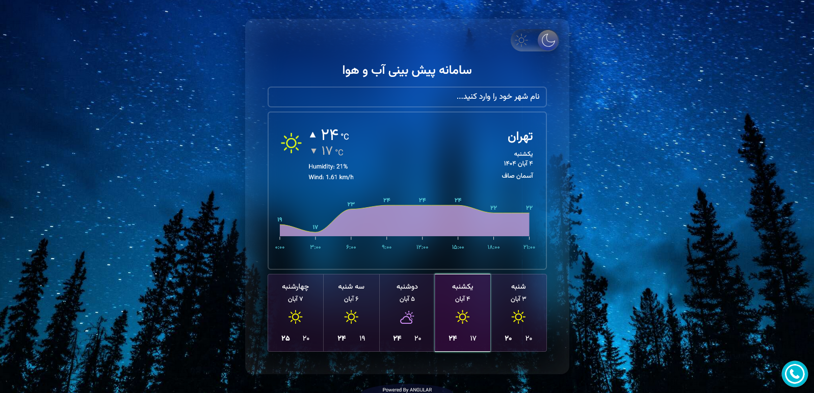

# 🅰️ Weather forecast

A modern, responsive weather forecast app, built with **Angular 17**, designed with dark/light theme.

---

## 🚀 Demo

👉 [Live Demo](https://weatherforecast-ng.netlify.app)

---

## ✨ Features

- 🖼️ Real weather info using real API.   
- 🔍 Contains weahter info of most cities in Iran.  
- 🎨 Dark & light themes
- ⚡ Show chart temp info for every 3HR in each day. 
- 💾 Stores your last chosen city in the localStorage
- 💻 Full responsive

---

## 🛠️ Tech Stack

- **Angular 17+**
- **TypeScript**
- **RxJS**
- **LocalStorage API**
- **HTML5 / CSS3 / Flex**

